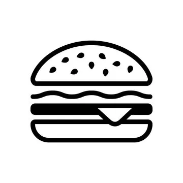

1. DOCTYPE et Structure de base
<!DOCTYPE html>
<html lang="en">

<!DOCTYPE html> : C'est la déclaration du type de document, elle informe le navigateur que la page est en HTML5.

<html lang="en"> : Cette balise ouvre le document HTML. lang="en" spécifie que la langue principale de la page est l'anglais.

2. Le head : Métadonnées et Liens
<head>
    <meta charset="UTF-8">
    <meta name="viewport" content="width=device-width, initial-scale=1.0">
    <title>GoMyCode</title>
    <link rel="stylesheet" href="./style/bootstrap/css/bootstrap.min.css">
</head>

<meta charset="UTF-8"> : Indique l'encodage des caractères (UTF-8 est le plus commun et prend en charge presque tous les caractères).

<meta name="viewport" content="width=device-width, initial-scale=1.0"> : Rendre la page responsive, c’est-à-dire qu'elle s'adapte à toutes les tailles d'écran.

<title>GoMyCode</title> : Le titre de la page qui apparaît dans l'onglet du navigateur.

<link rel="stylesheet" href="./style/bootstrap/css/bootstrap.min.css"> : Charge le fichier CSS de Bootstrap pour styliser la page. Bootstrap est une bibliothèque CSS populaire qui simplifie la création de mises en page.

3. Le body : Contenu visible

<body>
    <header>...</header>
    <main>...</main>
    <footer>...</footer>
    
</body>

Tout le contenu visible sur la page se trouve entre les balises <body>.

4. Le header : La Barre de Navigation et le Carousel
a. Barre de Navigation

<nav class="navbar navbar-expand-lg bg-body-tertiary">

La balise nav est utilisée pour la navigation principale.
class="navbar navbar-expand-lg bg-body-tertiary" :  applique des classes Bootstrap pour styliser la barre de navigation. 

navbar-expand-lg rend la barre responsive, et bg-body-tertiary est une classe Bootstrap pour le background.

Lien avec un logo qui ramène à la page d'accueil (href="/"). img est utilisé pour afficher le logo.

<button class="navbar-toggler" ...>
    
        
    
</button>

Un bouton pour activer/désactiver la navigation sur les petits écrans (menu burger).

<ul class="navbar-nav">...</ul>
Liste non ordonnée (<ul>) contenant les éléments du menu. Chaque élément du menu est une <li> (list item).

    
...

id="carouselExample" : Un identifiant unique pour le carousel.
class="carousel slide" : Classes Bootstrap pour activer la fonctionnalité de carousel.

5. Le main : Contenu Principal

<main>
    
...

</main>

Le contenu principal de la page est placé ici.
class="container" est une classe Bootstrap qui centre le contenu et lui donne un peu de padding.
6. Le footer : Pied de Page

<footer>
    

        

            
© 2024 GoMyCode. Tout droits reserve.

        

    

</footer>

Le pied de page (<footer>) contient le texte des droits d'auteur.
text-center centre le texte.

7. Scripts

Ce script est utilisé pour activer les fonctionnalités interactives de Bootstrap (comme le menu déroulant et le carousel).

Ce code HTML structure une page web basique avec une barre de navigation, un carousel, et une galerie de produits. Il utilise Bootstrap pour le style et la mise en page responsive. 
